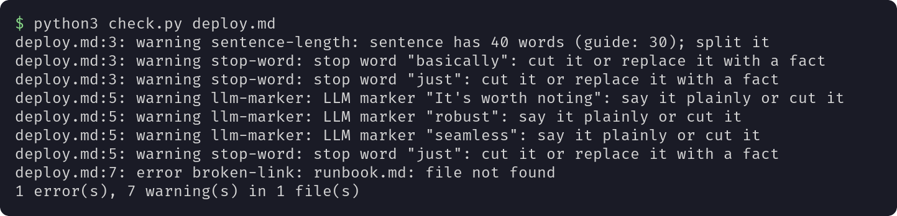
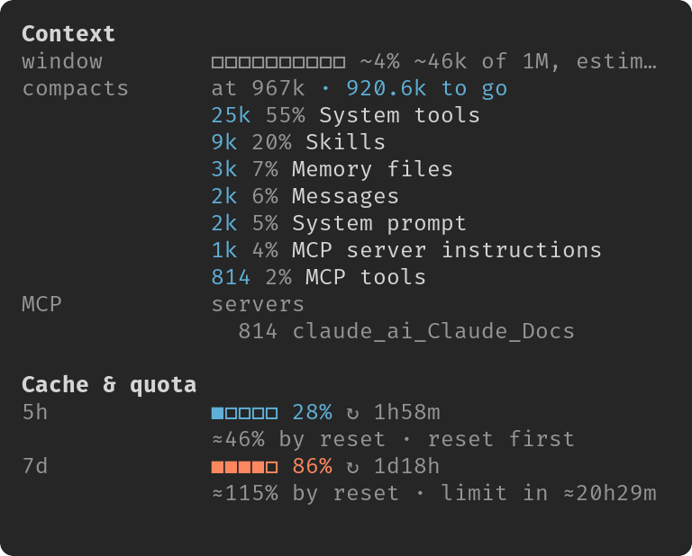

# claude-skills

[](https://github.com/VizzleTF/claude-skills/actions/workflows/ci.yml)

The Claude Code plugin marketplace `vizzletf-skills`. It has two plugins:

| Plugin | What it does | Needs |
|---|---|---|
| [technical-writing](#technical-writing) | Writes and reviews documentation by type: README, runbook, ADR, changelog and 9 more. Two editions: `technical-writing` with English instructions, `technical-writing-ru` with Russian | Python 3 for the text checker |
| [tidemark](#tidemark) | Draws a band above the prompt: context fill, prompt cache, quota, model, git | Claude Code 2.1.288 or later |

## Install

Add the marketplace once, then install the plugins you want:

```
/plugin marketplace add VizzleTF/claude-skills
/plugin install technical-writing@vizzletf-skills
/plugin install tidemark@vizzletf-skills
```

## technical-writing

The skill finds the reader first, picks one of 13 document types and writes to that type's skeleton and length budget. On 28 test scenarios its documents came out 20–30% shorter than with the earlier `writing-docs` skill, at the same judge score or higher.

Install one edition only, `technical-writing` or `technical-writing-ru`: both trigger on the same requests.

Ask Claude `Write a runbook for the alert QueueWorkerDown`, or run `/technical-writing:runbook alert QueueWorkerDown`. You get a runbook: impact, diagnosis, actions with a verification command each, escalation.

The bundled checker flags long sentences, stop words, LLM markers and broken links in any Markdown file:

```sh
python3 plugins/technical-writing/skills/write/scripts/check.py deploy.md
```



<details>
<summary>All 13 commands</summary>

`/technical-writing:write` picks the type from the request. Each type also has its own command:

| Command | Document |
|---|---|
| `/technical-writing:adr` | Record of a decision and its trade-offs |
| `/technical-writing:changelog` | What changed between versions |
| `/technical-writing:cli-help-errors` | --help text and error messages |
| `/technical-writing:conventions` | Rules the team follows |
| `/technical-writing:docstring` | Docstring or code comment |
| `/technical-writing:explanation` | Why the system is built this way |
| `/technical-writing:how-to` | Steps to one goal for someone mid-task |
| `/technical-writing:postmortem` | Record of an incident and its follow-ups |
| `/technical-writing:readme` | First page of a project |
| `/technical-writing:reference` | Facts to look up: options, fields, limits |
| `/technical-writing:runbook` | Steps for on-call when an alert fires |
| `/technical-writing:troubleshooting` | Symptom or error, its cause and fix |
| `/technical-writing:tutorial` | Lesson for a newcomer, one guided path |

</details>

Changelog: [technical-writing](plugins/technical-writing/CHANGELOG.md), [technical-writing-ru](plugins/technical-writing-ru/CHANGELOG.md).

## tidemark

A mod that draws a band of widgets above the Claude Code prompt, in the terminal and in the desktop app's Code tab. It leaves your `statusLine` and settings alone. The band appears right after the install; if it does not, run `/reload-plugins`.


`/tidemark` opens a details pane with the context breakdown, quota forecast and subagents. `/tidemark-config` edits the widgets with a live preview.



Widgets, config, privacy and uninstall: [tidemark README](plugins/tidemark/README.md).

## Links

- [README на русском](README.ru.md)
- [Contributing](CONTRIBUTING.md)
- License: [MIT](LICENSE)
